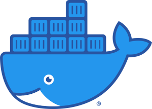

<div  style="text-align:center">
  
</div>

# Docker RUN
  Comando utilizado para criar um container

```
docker run --name newcontainer [name_container]
docker run --name [name_container] -d busybox sleep 3600
docker run --name [name_container] -d -p 80:80 nginx
```

# Docker PS
Lista os container em execução, para listar os que não estão precisamos colocar o parâmetro -a
```
docker ps -a
```
# Docker INFO
Exibe um sumuário dos nossos container, como também especificações do nosso docker
```
docker info
```
# Docker EXEC
Adiciona um processo a mais no container
Vamos criar uma pasta dentro do container
```
docker exec [name_container] mkdir [diretorio]
```

# Acesso ao container com o serviço SH
```
docker exec -it [name_container] sh
```
